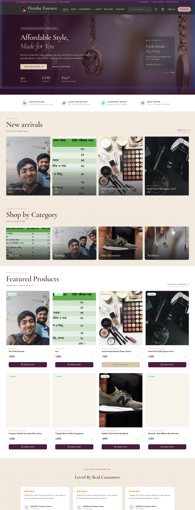
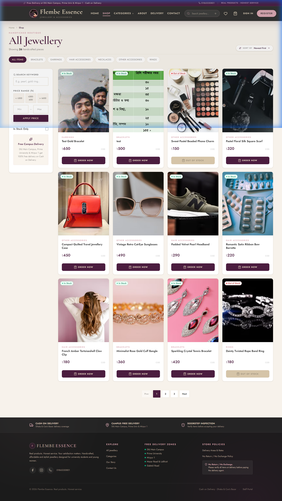
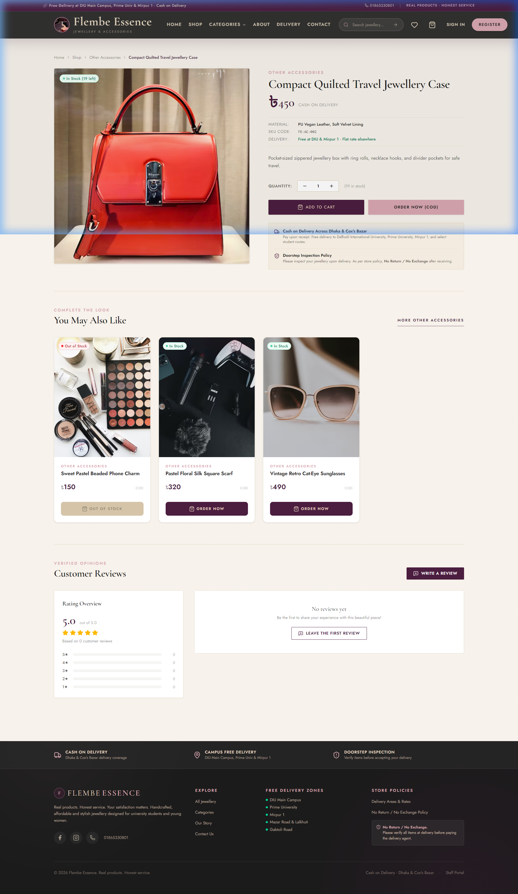
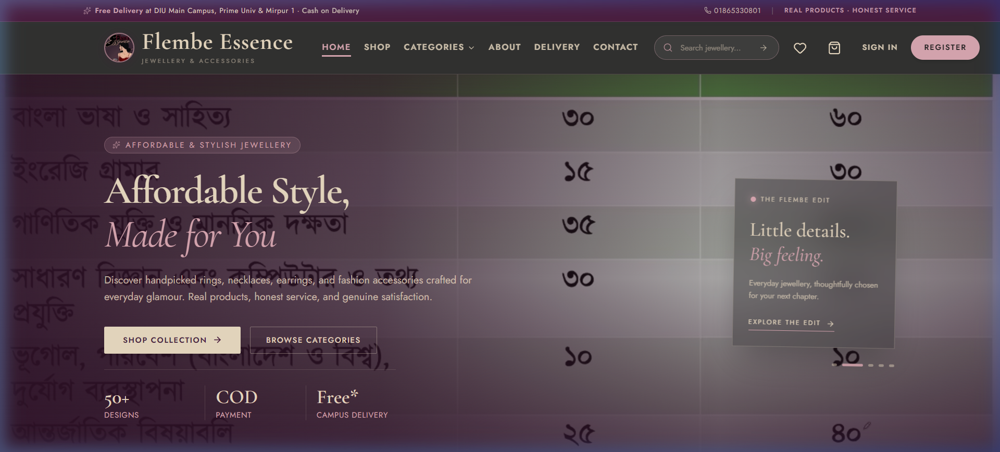
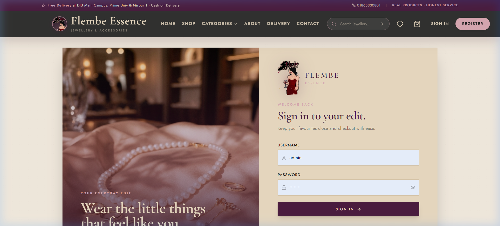
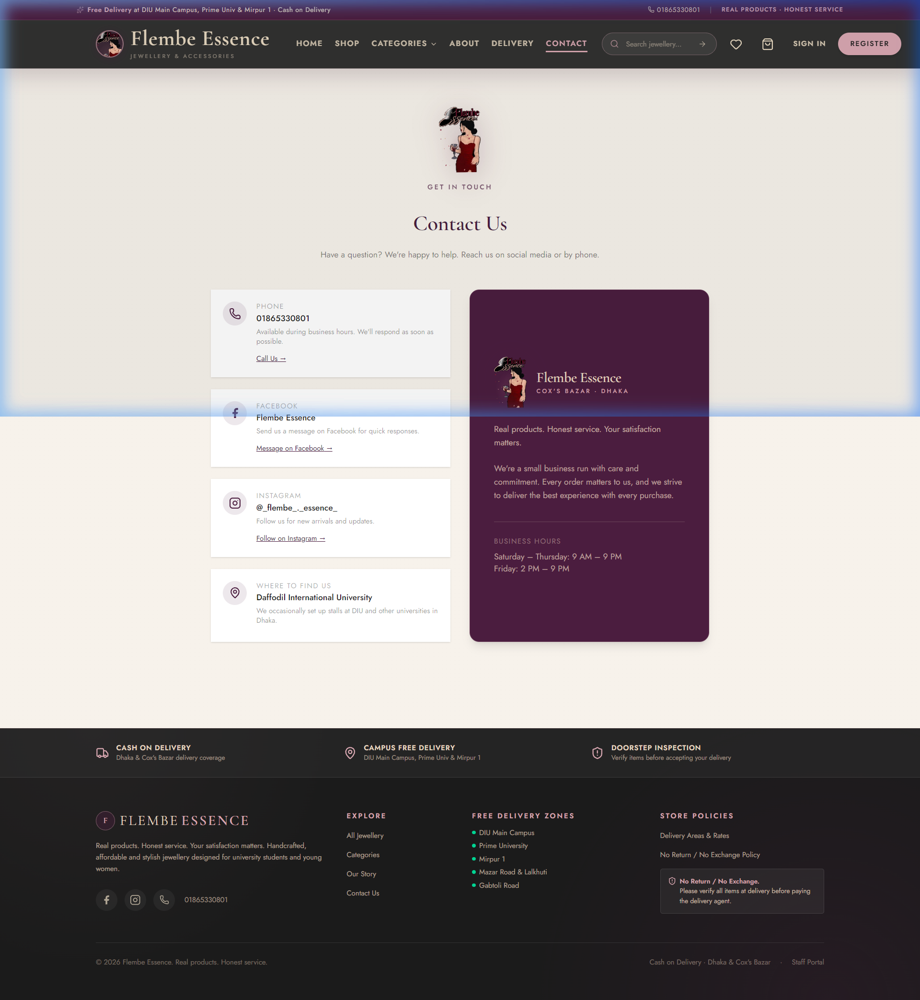

# Flembe Essence — Production-Grade Full-Stack E-Commerce

<p align="center">
  
</p>

<p align="center">
  <strong>Real products. Honest service. Your satisfaction matters.</strong><br/>
  <em>An elegant, mobile-first e-commerce platform for affordable jewellery and fashion accessories.</em>
</p>

<p align="center">
  
  
  
  
  
  
  
</p>

---

## 📸 Visual Showcase & Screenshots

### 1. Storefront Homepage
> *Hero presentation, curated categories, campus free delivery announcements, and featured jewellery edit.*



---

### 2. Product Catalog & Filter Engine (`/shop`)
> *Dynamic multi-facet filtering by category, price range presets, and in-stock toggles with 2-column mobile to 4-column desktop responsive grid.*



---

### 3. Product Detail & Quick Purchase (`/products/:slug`)
> *Image galleries, material specifications, live stock indicators, quantity selectors, and floating mobile quick-buy bars.*



---

### 4. Mobile-First Experience & Bottom Navigation
> *Native-app feel with sticky bottom navigation (Home, Shop, Wishlist, Bag, Profile) with live badge counters and safe-area padding.*

<p align="center">
  
</p>

---

### 5. Sign In & Customer Account (`/login` & `/register`)
> *Branded authentication interface featuring the custom animated Flembe Essence logo with light sweeps and floating petals.*



---

### 6. Campus Pickup & Contact (`/contact`)
> *Free Delivery coverage for Daffodil International University (DIU), Prime University, and Mirpur 1 with direct social channels.*



---

## 💎 Core Highlights & Production Features

### 🛒 Customer Experience
- **Mobile-First UX**: Responsive 2-column mobile layout, sticky bottom navigation bar with live cart/wishlist counters, and floating bottom purchase bars.
- **Cash on Delivery (COD) Only**: Optimized for the local Bangladeshi market with zero friction.
- **Campus & Regional Free Delivery**: Database-driven zones calculate exact delivery fees; students at **DIU Main Campus, Prime University, and Mirpur 1** get automatic free delivery.
- **Out-of-Stock Waitlists**: Shoppers can register for restock notifications with one tap when products are sold out.
- **Explicit No-Return / No-Exchange Policy**: Embedded policy checkboxes and customer agreements stored directly on orders.
- **Animated Vector Branding**: Integrates the bespoke `flembe-essence-logo-animated.svg` across navigation, auth, about, and contact pages.

### ⚙️ Operational & Admin Superpowers
- **1-Click Printable Delivery/Packing Slip**: Dedicated invoice generator with `@media print` paper isolation for couriers and campus messengers.
- **Atomic Stock Management**: `select_for_update()` database row locking during order placement eliminates overselling risks under concurrent traffic.
- **Restock Demand Intelligence**: Admin dashboard highlights highest-demand out-of-stock items based on customer restock requests.
- **Custom Admin CRUD**: Complete management for Products, Categories, Delivery Zones, Order Statuses, and Verified Reviews.
- **Review Moderation Pipeline**: Customers submit reviews and star ratings; admin can approve, feature, or remove entries.

---

## 🏛️ Architecture & Tech Stack

```
Flembe Essence/
├── backend/                  # Python 3.11 + Django 5 + Django REST Framework
│   ├── core/                 # Settings, base models, master router, tests (50/50 passing)
│   ├── catalog/              # Scalable hierarchical categories, products, images
│   ├── orders/               # Orders, line items, snapshots, restock waitlists
│   ├── delivery/             # Delivery zones and rate calculations
│   └── reviews/              # Product ratings and reviews
└── frontend/                 # React 18 + TypeScript + Vite + Tailwind CSS v4
    └── src/
        ├── components/       # FlembeLogo, MobileBottomNav, Navbar, ProductCard, etc.
        ├── pages/            # Homepage, Shop, ProductDetail, Checkout, Admin, etc.
        ├── context/          # AuthContext, CartContext, WishlistContext
        └── lib/              # Axios API client and TanStack queries
```

| Layer | Technology | Key Capabilities |
| :--- | :--- | :--- |
| **Frontend** | React 18, TypeScript, Vite | Fast HMR, type safety, sub-2.5s production build |
| **Styling** | Tailwind CSS v4, Vanilla CSS | Minimalist luxury design system, iOS zoom prevention |
| **State & API** | TanStack React Query v5 | Automatic background refetching, cache invalidation |
| **Backend** | Python 3.11, Django 5, DRF | Relational ORM, atomic transactions, JWT auth |
| **Database** | PostgreSQL (Prod) / SQLite (Dev) | Indexes on slugs, SKUs, phone numbers, order statuses |
| **Deployment** | Render Blueprints (`render.yaml`) | Gunicorn + WhiteNoise + PostgreSQL auto-deploy |

---

## 🎨 Brand Identity & Palette

```css
--burgundy:   #4B1D3F;  /* Primary brand color, CTA buttons, headings */
--nude:       #E8D9C1;  /* Soft backgrounds and card surfaces */
--rose-smoke: #D8A7B1;  /* Accents, badges, active route glows */
--off-black:  #1B1B1B;  /* Body typography and high-contrast text */
```

*Design Philosophy: Minimalist · Elegant · Modern · Feminine · Clean*

---

## 🚀 Quick Start (Local Development)

### 1. Backend Setup

```bash
cd backend

# Create and activate virtualenv
python -m venv venv
venv\Scripts\activate       # Windows
# source venv/bin/activate  # macOS / Linux

# Install dependencies
pip install django djangorestframework djangorestframework-simplejwt django-cors-headers psycopg2-binary python-decouple cloudinary django-cloudinary-storage django-filter

# Setup environment
cp .env.example .env

# Run migrations and seed data
python manage.py migrate
python manage.py seed_data      # Creates demo categories, products, delivery zones
python manage.py createsuperuser

# Start backend server
python manage.py runserver 8000
```

### 2. Frontend Setup

```bash
cd frontend

# Install packages
npm install

# Setup environment
cp .env.example .env   # Ensure VITE_API_URL=http://127.0.0.1:8000/api/v1

# Run development server
npm run dev
```

Visit the storefront at **`http://localhost:5173`**.

---

## 🧪 Testing & Verification

The Django test suite covers all critical business workflows, security constraints, and financial calculations:

```bash
cd backend
python manage.py test --verbosity=2
```

```text
Ran 50 tests in 58.892s
OK (50/50 tests passed)
```

### Test Coverage Highlights:
- ✅ **Catalog**: Category hierarchies, slug uniqueness, product listings, price filtering, search queries.
- ✅ **Inventory**: Dynamic stock status, atomic stock decrementing, out-of-stock order prevention.
- ✅ **Orders**: Subtotal computation, dynamic delivery zone charge calculations, mandatory policy acceptance.
- ✅ **Fulfillment**: Valid and invalid status transitions (`PENDING` → `CONFIRMED` → `PROCESSING` → `SHIPPED` → `DELIVERED`).
- ✅ **Security**: Admin-only permissions, JWT token authentication, input validation.

---

## 🌐 API Reference

Base API Path: `/api/v1/`

### 🔑 Authentication
| Method | Endpoint | Description |
| :--- | :--- | :--- |
| `POST` | `/api/v1/auth/login/` | Obtain JWT token pair |
| `POST` | `/api/v1/auth/token/refresh/` | Refresh JWT access token |
| `POST` | `/api/v1/auth/register/` | Register new customer account |
| `GET` | `/api/v1/auth/me/` | Get authenticated user profile |

### 💍 Products & Categories
| Method | Endpoint | Description |
| :--- | :--- | :--- |
| `GET` | `/api/v1/categories/` | List all active categories |
| `GET` | `/api/v1/products/` | Filter products (`search`, `category`, `min_price`, `max_price`, `in_stock`, `ordering`) |
| `GET` | `/api/v1/products/:slug/` | Retrieve product detail and gallery |
| `POST` | `/api/v1/products/:slug/restock-notification/` | Join out-of-stock waitlist |

### 📦 Orders & Delivery
| Method | Endpoint | Description |
| :--- | :--- | :--- |
| `GET` | `/api/v1/delivery-zones/` | List delivery areas and charges |
| `POST` | `/api/v1/orders/` | Place a Cash-on-Delivery order |
| `GET` | `/api/v1/orders/:order_number/` | Order confirmation & status check |
| `GET` | `/api/v1/admin/orders/` | Admin order list with search & filter |
| `PATCH` | `/api/v1/admin/orders/:order_number/status/` | Update order fulfillment status |

---

## 🚢 Production Deployment (Render)

This repository includes a turnkey **`render.yaml`** configuration:

1. Connect your repository to **[Render](https://render.com)**.
2. Select **Blueprints** and pick `render.yaml`.
3. Render automatically provisions:
   - A managed **PostgreSQL Database** (`flembe-essence-db`)
   - A Python/Django **Web Service** (`flembe-essence-backend`) running Gunicorn and WhiteNoise
   - A Node/Vite **Static Site** (`flembe-essence-frontend`) with SPA rewrites

For step-by-step instructions, see [`docs/RENDER_DEPLOYMENT.md`](docs/RENDER_DEPLOYMENT.md).

---

## 📞 Business & Contact Information

- **Phone**: `01865330801`
- **Facebook**: [facebook.com/share/19bb8cxwHW/](https://www.facebook.com/share/19bb8cxwHW/)
- **Instagram**: [@_flembe_._essence_](https://www.instagram.com/_flembe_._essence_)
- **Campus Stalls**: Daffodil International University (DIU), Ashulia, Dhaka
- **Origin**: Cox's Bazar, Bangladesh
